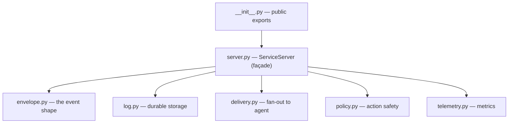

# mcp-service-base — Overview

A small, reusable Python library that lets every Central QSR Agent service (real
pipeline or simulator) expose its data and actions to the agent through **one
uniform contract**. Write a service once, and the agent talks to all services the
same way — it can't tell a real pipeline from a simulator.

## What it does

A service imports this library, declares its **event schema** and its
**read/act tools**, and runs it. The library provides everything else:

| Concern | Provided by |
|---|---|
| MCP server (describe / subscribe / read / act) | `ServiceServer.to_mcp()` |
| Event envelope + emit | `envelope.py`, `emit()` |
| Durable, replayable log (db **or** file) | `SQLiteLog`, `JSONLFileLog` |
| Event delivery / fan-out + retries | `Delivery` (EventHub / Webhook / Off) |
| Action safety (auto / notify / approval / blocked) | `PolicyGate` |
| Metrics / timing | `Telemetry` (pluggable, `NullTelemetry` to opt out) |
| Per-tool timeout | `tool_timeout_s` |

The service writes only **domain code**; the library is domain-agnostic.

## How a service uses it

```python
from mcp_service_base import ServiceServer, ServiceConfig, GateLevel

svc = ServiceServer.from_config(ServiceConfig(
    service="suspicious_activity", store_id="store_001",
    log_backend="jsonl", log_path="/data/sad.jsonl",
))

@svc.read_tool("Get_activity_by_zone")
def get_activity_by_zone(zone: str) -> list[dict]:
    """List activities for a zone."""          # docstring = tool description
    return queries.activity_by_zone(svc.log, zone)

@svc.act_tool("notify_operator", level=GateLevel.AUTOMATIC)
def notify_operator(zone: str, message: str) -> dict:
    """Surface an event to the operator."""
    return {"notified": zone}

svc.run(transport="streamable-http", host="0.0.0.0", port=9000)
```

## How an event flows

```
pipeline → ingest → svc.emit() → durable log (FIRST, idempotent on ref_id)
                                → fan out to the agent (retries)
agent → describe → read tools (direct) / act tools (through Policy Gate)
```

Log-first means nothing is lost and every run is replayable. `ref_id` (the source
message id) makes re-delivery idempotent.

## Design patterns

- **Façade** — apps use `ServiceServer` only, never internal classes.
- **Strategy** — pluggable log (`DurableLog`), delivery (`Sink`), metrics (`MetricsBackend`).
- **Adapter** — `to_mcp()` adapts tools to the MCP SDK (works on 1.x `FastMCP` and 2.x `MCPServer`).

## Versioning

Released as git tags (`v0.1.0` … `v0.2.0`). Each app pins a version, so different
apps can run different versions independently:

```
mcp-service-base[mcp] @ git+https://github.com/sachinkaushik/mcp-service-base.git@v0.2.0
```

## Status

Generic base, proven on the **SLP Suspicious-Activity (SAD)** service (sample data
for now). Hardened as more services are built on it.

---

## Internals — how each file works

The package lives in `src/mcp_service_base/`. `server.py` is the conductor; the
other files are the pieces it orchestrates.



### `envelope.py` — the event shape
- `EventEnvelope` — frozen dataclass: `event_type`, `service`, `store_id`, `payload`, `ref_id`, `ts_ms`, `schema_version`.
- `new_event(...)` — factory that auto-fills `ref_id` and `ts_ms`.
- `to_json()` / `from_json()` — serialize for storage and transport.
- `ref_id` is what makes replay idempotent.

### `log.py` — durable log (Strategy)
- `DurableLog` — Protocol (interface): `append()`, `read()`, `replay()`.
- `SQLiteLog` — default; autoincrement `seq` (order), `UNIQUE ref_id` (idempotency), WAL (restart-safe).
- `JSONLFileLog` — same contract, append-only JSON-lines file; rebuilds state on open.
- `append()` = persist + dedupe on `ref_id`; `read()` = query; `replay()` = yield in order.

### `delivery.py` — fan-out to the agent (Strategy)
- `Sink` — Protocol: `push(event) -> bool`.
- `DisabledSink` (off), `WebhookSink` (HTTP POST), `EventHubSink` (shared hub adapter).
- `Delivery.dispatch()` — sends to all sinks with bounded retries + backoff; nothing dropped silently.

### `policy.py` — action safety gate
- `GateLevel` — `AUTOMATIC | NOTIFY | NEEDS_APPROVAL | BLOCKED`.
- `ActionSpec` — gate level + optional rate limit (sliding window).
- `PolicyGate.evaluate(name, args)` — allow-list check → decision; unregistered = blocked, approval = human callback.
- Runs **before** any action; the LLM proposes, plain code decides.

### `telemetry.py` — metrics (Strategy)
- `Span` — one timing record.
- `MetricsBackend` — Protocol (`span()` + `drain()`).
- `Telemetry` (in-memory, default) and `NullTelemetry` (no-op).

### `server.py` — `ServiceServer` (Façade + Adapter)
- `ServiceConfig` + `from_config()` — build a server by choosing log/delivery/metrics/timeout, no internal imports.
- `register_event_type()` — declares an event schema (feeds `describe`).
- `read_tool()` / `act_tool()` — decorators; description defaults to the docstring; `act_tool` also registers with the Policy Gate.
- `emit()` — write path: `new_event → log.append (first) → delivery.dispatch`, inside a telemetry span.
- `call_action()` — act path: `policy.evaluate` → run if allowed (with timeout + telemetry).
- `describe()` — returns the full contract.
- `to_mcp()` (Adapter) — builds the MCP server: lazy-imports the SDK (2.x `MCPServer` / 1.x `FastMCP`), auto-adds `describe` + `subscribe`, binds read tools (telemetry + timeout, signature preserved via `functools.wraps`) and act tools (through the gate).
- `run(transport, host, port)` — starts it (`stdio` local, `streamable-http`/`sse` networked).

### `__init__.py` — public API
- The curated names a service imports (`ServiceServer`, `ServiceConfig`, `GateLevel`, log/sink/telemetry classes) + `__version__`.

---

## End-to-end paths

**Write path (an event arrives):**
```
service.emit() → new_event()          [envelope.py]
             → log.append()           [log.py]  (first, idempotent on ref_id)
             → delivery.dispatch()     [delivery.py]  (fan-out + retries)
             → telemetry span          [telemetry.py]
```

**Read / act path (the agent calls):**
```
agent → describe / subscribe          [auto, server.py]
      → read tool → your fn → log.read()          [log.py]
      → act tool  → policy.evaluate()  [policy.py] → your fn (only if allowed)
```

`server.py` is the façade a service uses; `envelope / log / delivery / policy /
telemetry` are the pluggable pieces it orchestrates; and the agent only ever sees
the uniform describe/subscribe/read/act contract.

